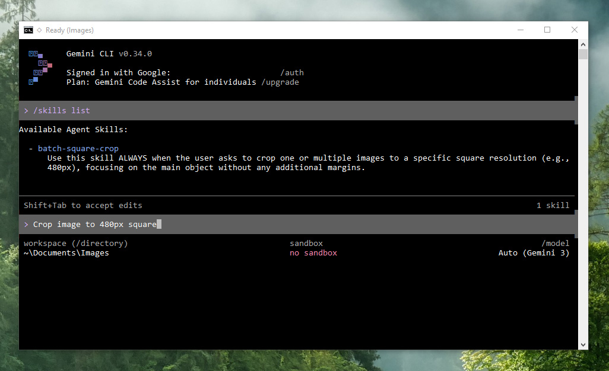
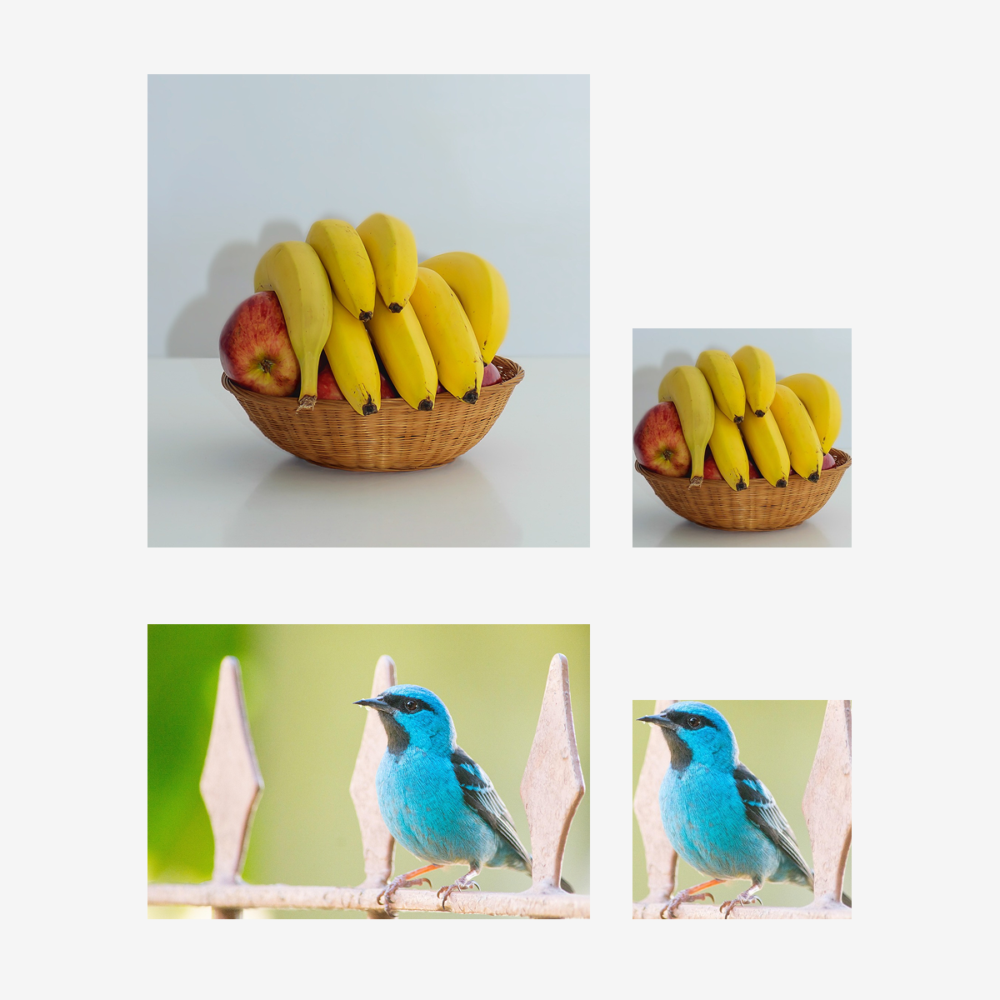
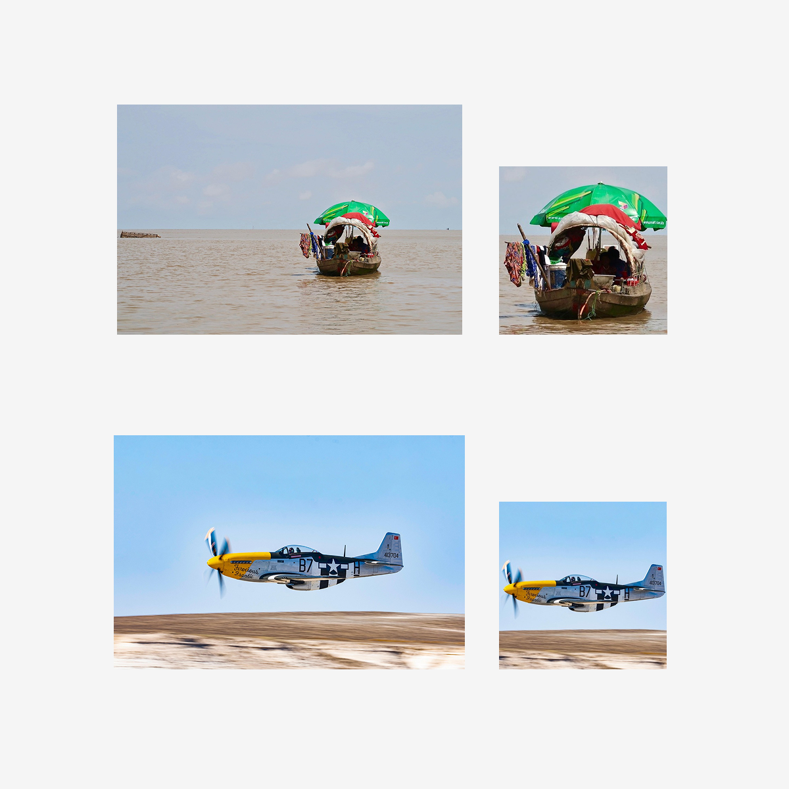
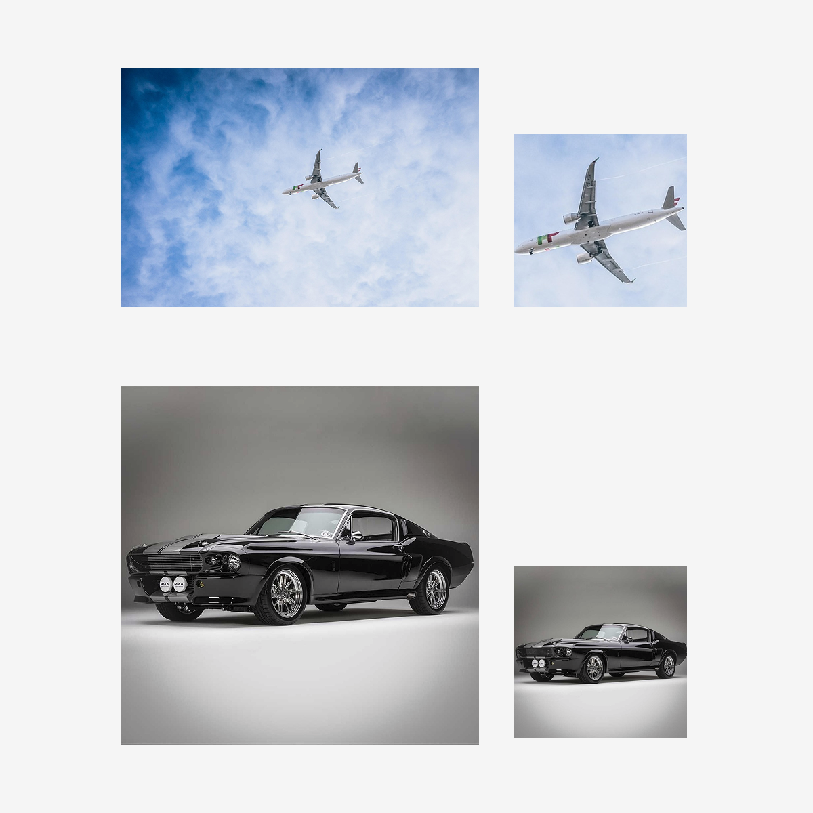

# Batch Square Crop Skill 🖼️✂️

**AI-Powered Smart Image Cropping for Gemini CLI**

   

## Overview

**Batch Square Crop** is a specialized skill for the Gemini CLI designed for DTP professionals and graphic designers. It automates the process of batch-cropping images into perfect squares while ensuring the main subject remains centered. By utilizing Gemini's vision capabilities and ImageMagick's precision, this skill eliminates the manual task of framing and resizing hundreds of product photos or assets.



**Perfect for:** E-commerce product photo preparation, social media assets, and standardizing large image libraries for DTP layouts.

---

## ✨ Key Features

### AI Object Detection
- **Smart Centering**: Automatically identifies the primary object in each image and calculates the optimal crop based on its center.
- **Zero Margins**: Crops precisely to the object without adding unnecessary padding, ensuring a clean, professional look.

### Batch Processing
- **Efficiency**: Handles multiple images in the current directory with a single command.
- **Non-destructive**: All cropped images are saved to a dedicated `cropped/` subfolder, keeping your original files untouched.

### Production-Ready Precision
- **ImageMagick Integration**: Uses standard DTP flags like `+repage` to reset canvas geometry, ensuring compatibility with layout software like InDesign or Affinity Publisher.
- **Resolution Control**: Automatically resizes all crops to your target pixel resolution (e.g., 480px, 1080px).

---

## 🎨 Examples

Here are examples of images automatically cropped and centered by the skill:

| Example 1 | Example 2 | Example 3 |
| :---: | :---: | :---: |
|  |  |  |

---

## 🚀 Setup & Requirements

### Dependencies
1. **Gemini CLI**: This skill must be loaded into your Gemini CLI environment.
2. **ImageMagick**: Must be installed and available in your system's PATH.
   - Verify by running `magick -version` in your terminal.

### Installation
1. Ensure the `batch-square-crop` folder is in your Gemini CLI skills directory.
2. The skill is defined in `SKILL.md`.

---

## 📖 Usage Guide

### Activation
Simply activate the skill when chatting with Gemini CLI:
```text
Activate the batch-square-crop skill and crop all images in the folder to 480px.
```

### How it Works
1. **Analysis**: Gemini uses its vision API to locate the main object in each image.
2. **Calculation**: It calculates the largest possible square centered on that object, clamping the edges to the image boundaries.
3. **Execution**: It runs a precise ImageMagick command:
   ```bash
   magick "input.jpg" -crop [S]x[S]+[X]+[Y] +repage -resize [R]x[R]! "cropped/input.jpg"
   ```

---

## 💡 Pro Tips

- **Consistent Resolution**: Specify a standard resolution (like 1080px) for all your social media or web assets to maintain a unified look.
- **Clean Backgrounds**: While the skill works on complex images, it is exceptionally fast and accurate for product photography on solid backgrounds.
- **Automate Your Workflow**: Combine this skill with other CLI tools to move, rename, or upload your newly cropped assets.

## 📄 License

This project is licensed under the **MIT License**.

---

*Created by a DTP professional for professionals.*
